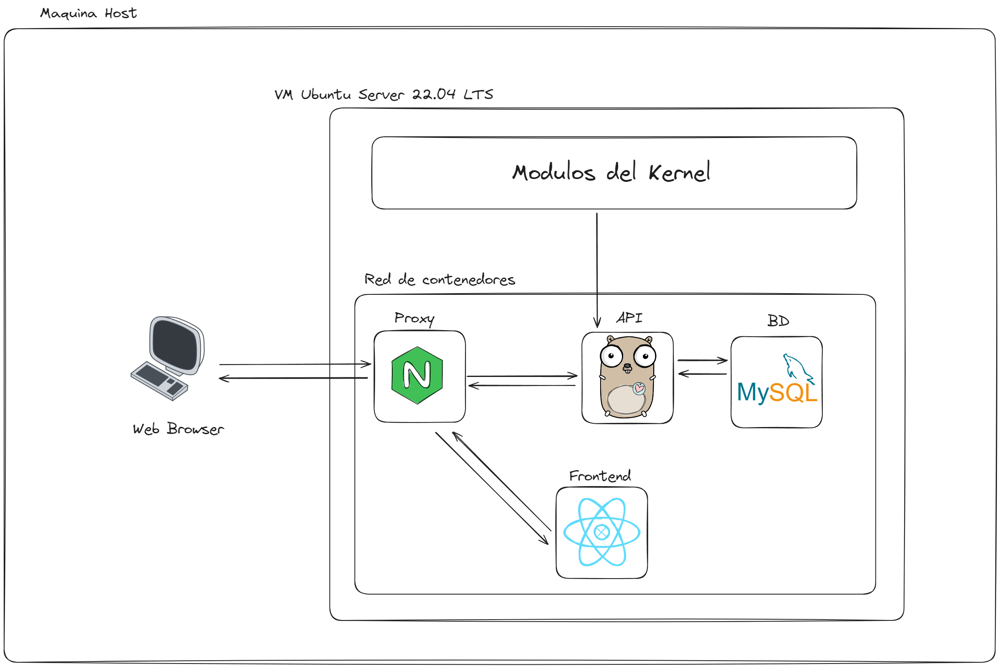
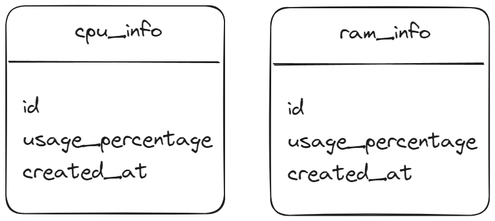

# **Proyecto 1**

### Universidad de San Carlos de Guatemala

### Facultad de Ingeniería

### Escuela de Ciencias y Sistemas

### Sistemas Operativos 1

<br></br>

## **Manual Técnico**

<br></br>

| Nombre                   | Carnet    |
| ------------------------ | --------- |
| Damián Ignacio Peña Afre | 202110568 |

---

## **Tabla de Contenido**

- [Descripción General](#descripción-general)

## **Descripción General**

En este proyecto, se tiene como objetivo principal implementar un sistema de monitoreo de recursos del sistema y gestión de procesos, empleando varias tecnologías y lenguajes de programación. El sistema resultante permitirá obtener información clave sobre el rendimiento del computador, procesos en ejecución y su administración a través de una interfaz amigable.

## **Arquitectura del proyecto**

El proyecto se compone de múltiples imagenes montadas sobre una VM con sistema operativo Ubuntu Server 22.04 LTS. Se detalla a continuación con un diagrama:


## **Modulos de CPU**

Objetivo del módulo: El módulo de kernel proporciona información sobre la utilización de la CPU y los procesos en el sistema.

Funcionalidad del módulo:

Calcula el tiempo total de la CPU y el uso total de la CPU.
Calcula el porcentaje de uso de la CPU.
Enumera todos los procesos en ejecución y sus características, como PID, nombre y estado.
Enumera los procesos secundarios de cada proceso principal.
Estructura del módulo:

Incluye las bibliotecas necesarias.
Declara las variables y estructuras necesarias.
Define las funciones para calcular el uso de la CPU y escribir la información en el archivo /proc.
Define la función para recorrer los procesos secundarios.
Define las operaciones del archivo /proc.
Define las funciones de inicialización y limpieza del módulo.
Funcionamiento:

Al cargar el módulo, crea un archivo en el sistema de archivos proc (/proc) para mostrar la información recopilada.
Al descargar el módulo, elimina el archivo /proc.

```c
#include <linux/module.h>
#include <linux/kernel.h>
#include <linux/sched.h>
#include <linux/timekeeping.h>
#include <linux/timer.h>
#include <linux/jiffies.h>
#include <linux/proc_fs.h>
#include <linux/seq_file.h>
#include <asm/uaccess.h>
#include <linux/mm.h>
#include <linux/sched/cputime.h>
#include <linux/timekeeping.h>
#include <linux/time.h>

MODULE_LICENSE("GPL");
MODULE_AUTHOR("Damian");
MODULE_DESCRIPTION("Informacion cpu");
MODULE_VERSION("1.0");

struct task_struct *task;
struct task_struct *task_child
struct list_head *list;
struct task_struct *cpu;
uint64_t total_time_cpu;
uint64_t total_usage;
unsigned long usage_percentage;

static void traverse_children(struct seq_file *file_proc, struct list_head *children);
static int escribir_a_proc(struct seq_file *file_proc, void *v)
{
    int running = 0;
    int sleeping = 0;
    int zombie = 0;
    int stopped = 0;
    unsigned long rss;
    unsigned long total_ram_pages;

    total_ram_pages = totalram_pages();
    if (!total_ram_pages)
    {
        pr_err("No memory available\n");
        return -EINVAL;
    }

#ifndef CONFIG_MMU
    pr_err("No MMU, cannot calculate RSS.\n");
    return -EINVAL;
#endif


    total_time_cpu = 0;
    total_usage = 0;
    usage_percentage=0;

    for_each_process(cpu) {
        uint64_t cpu_time_ns;
        cpu_time_ns = cpu->utime + cpu->stime;
        total_usage += cpu_time_ns;
    }

    total_time_cpu = ktime_to_ns(ktime_get());

    if (total_time_cpu > 0) { usage_percentage = (total_usage * 100) / total_time_cpu; }
    else { usage_percentage = 0; }

    seq_printf(file_proc, "{\n\"percentage\": %ld,\n", usage_percentage);
    seq_printf(file_proc, "\"total_usage\":%u,\n", total_usage);
    seq_printf(file_proc, "\"total_time_cpu\":%u,\n", total_time_cpu);
    seq_printf(file_proc, "\"processes\":[\n");

    int first_process = 1;

    for_each_process(cpu) {
        if (!first_process) {seq_printf(file_proc, ",\n");}
        first_process = 0;
        seq_printf(file_proc, "    {\n");
        seq_printf(file_proc, "      \"pid\": %d,\n", cpu->pid);
        seq_printf(file_proc, "      \"name\": \"%s\",\n", cpu->comm);
        seq_printf(file_proc, "      \"state\": %u,\n", cpu->__state);
        if (!list_empty(&cpu->children)) {
            seq_printf(file_proc, "      \"child\": [\n");
            traverse_children(file_proc, &cpu->children);
            seq_printf(file_proc, "\n      ]");
        } else {
            seq_printf(file_proc, "      \"child\": []");
        }

        seq_printf(file_proc, "\n    }");
    }

    seq_printf(file_proc, "\n  ]\n");
    seq_printf(file_proc, "}\n");

    return 0;
}

static void traverse_children(struct seq_file *file_proc, struct list_head *children) {
    struct list_head *lstProcess;
    struct task_struct *child;
    int first_child = 1;

    list_for_each(lstProcess, children) {
        if (!first_child) { seq_printf(file_proc, ",\n");}
        first_child = 0;

        child = list_entry(lstProcess, struct task_struct, sibling);

        seq_printf(file_proc, "        {\n");
        seq_printf(file_proc, "          \"pid\": %d,\n", child->pid);
        seq_printf(file_proc, "          \"name\": \"%s\",\n", child->comm);
        seq_printf(file_proc, "          \"state\": %u,\n", child->__state);
        seq_printf(file_proc, "          \"pidPadre\": %u,\n", child->parent->pid);
        if (!list_empty(&child->children)) {
            seq_printf(file_proc, "          \"child\": [\n");
            traverse_children(file_proc, &child->children);
            seq_printf(file_proc, "\n          ]");
        } else {
            seq_printf(file_proc, "          \"child\": []");
        }
        seq_printf(file_proc, "        }");
    }
}

static int abrir_aproc(struct inode *inode, struct file *file)
{
    return single_open(file, escribir_a_proc, NULL);
}

static struct proc_ops archivo_operaciones = {
    .proc_open = abrir_aproc,
    .proc_read = seq_read};

static int __init modulo_init(void)
{
    proc_create("cpu_so1_1s2024", 0, NULL, &archivo_operaciones);
    printk(KERN_INFO "Insertar Modulo CPU\n");
    return 0;
}

static void __exit modulo_cleanup(void)
{
    remove_proc_entry("cpu_so1_1s2024", NULL);
    printk(KERN_INFO "Remover Modulo CPU\n");
}

module_init(modulo_init);
module_exit(modulo_cleanup);
```

## **Modulos de Memoria**

Objetivo del módulo: Proporcionar información sobre el uso de la memoria RAM del sistema.

Funcionalidad del módulo:

Utiliza la función si_meminfo() para obtener información sobre el estado de la memoria.
Calcula el total de memoria RAM, la memoria utilizada, la memoria libre y el porcentaje de memoria utilizada.
Escribe esta información en formato JSON en un archivo en el sistema de archivos proc (/proc).
Estructura del módulo:

Incluye las bibliotecas necesarias.
Declara las variables y estructuras necesarias.
Define la función para obtener información sobre la memoria y escribir en el archivo /proc.
Define la función de apertura del archivo /proc.
Define las operaciones del archivo /proc.
Define las funciones de inicialización y limpieza del módulo.
Funcionamiento:

Al cargar el módulo, crea un archivo en el sistema de archivos proc (/proc) para mostrar la información sobre la memoria RAM.
Al descargar el módulo, elimina el archivo /proc.
Este módulo proporciona una manera de monitorear el uso de la memoria RAM del sistema y obtener información detallada sobre su estado.

```c
#include <linux/module.h>
#include <linux/proc_fs.h>
#include <linux/sysinfo.h>
#include <linux/seq_file.h>
#include <linux/mm.h>

MODULE_LICENSE("GPL");
MODULE_AUTHOR("Damián Peña");
MODULE_DESCRIPTION("RAM information module");
MODULE_VERSION("1.0");

struct sysinfo inf;

static int write_proc(struct seq_file *file_proc, void *v)
{
    unsigned long total, used, notused;
    unsigned long porc;
    si_meminfo(&inf);

    total = inf.totalram * inf.mem_unit;

    notused = (inf.freeram * inf.mem_unit) + (inf.bufferram * inf.mem_unit) + (inf.sharedram * inf.mem_unit);
    used = total - notused;
    porc = (used * 100) / total;
    seq_printf(file_proc, "{\"total\":%lu, \"used\":%lu, \"percentage\":%lu, \"free\":%lu }", total, used, porc, notused);
    return 0;
}

static int open_proc(struct inode *inode, struct file *file)
{
    return single_open(file, write_proc, NULL);
}
static struct proc_ops op_file = {
    .proc_open = open_proc,
    .proc_read = seq_read
};

static int __init mod_init(void)
{
    proc_create("ram_so1_1s2024", 0, NULL, &op_file);
    printk(KERN_INFO "RAM module mounted\n");
    return 0;
}

static void __exit mod_cleanup(void)
{
    remove_proc_entry("ram_so1_1s2024", NULL);
    printk(KERN_INFO "RAM module removed \n");
}

module_init(mod_init);
module_exit(mod_cleanup);
```

## **Componentes de Frontend**

### **Monitoreo en tiempo real**

- Componente React:

Utiliza React para crear una interfaz de usuario dinámica.
Utiliza el estado (useState) y el efecto (useEffect) de React para gestionar y actualizar la información de la RAM y la CPU.
Realiza peticiones al servidor utilizando la función fetch() para obtener datos sobre la RAM y la CPU.

- Servidor Proxy:
  Recibe peticiones del cliente React y las redirige al servidor de la API.
  Las peticiones a /api/ram-info y /api/cpu-info son redirigidas al servidor de la API.

- Servidor de la API:

Implementa endpoints para obtener información sobre el uso de la RAM y la CPU.
La función getCpuIdle() obtiene el porcentaje de tiempo de inactividad de la CPU.
La función getRamUsage() obtiene información sobre el uso de la RAM.
Ambas funciones devuelven los datos en formato JSON.

```go
app.Get("/cpu-info", func(c *fiber.Ctx) error {
    idle, error := getCpuIdle()
    if error != nil {
        return c.SendString("Error al obtener el uso de la CPU")
    }
    c.Set(fiber.HeaderContentType, fiber.MIMEApplicationJSONCharsetUTF8)
    return c.JSON(
        fiber.Map{
            "idle": idle,
        })
})

app.Get("/ram-info", func(c *fiber.Ctx) error {

    out, error := getRamUsage()
    if error != nil {
        return c.SendString("Error al obtener el uso de la RAM")
    }

    c.Set(fiber.HeaderContentType, fiber.MIMEApplicationJSONCharsetUTF8)
    return c.SendString(out)
})
```

- Interfaz de Usuario (UI):

Muestra la información obtenida sobre la RAM y la CPU.
Utiliza el componente Pie de Chart.js para mostrar gráficos circulares que representan el uso de la RAM y la CPU.
Muestra el porcentaje de uso, la cantidad utilizada y la cantidad libre de la RAM y la CPU.

### **Información Histórica**

Este sección del código implementa una página que muestra información histórica sobre el uso de la CPU y la memoria RAM del sistema. A continuación, se explica cómo funciona:

- Componente React:

Utiliza React para crear una interfaz de usuario dinámica.
Utiliza el estado (useState) y el efecto (useEffect) de React para gestionar y actualizar la información histórica.
Realiza una petición al servidor utilizando la función fetch() para obtener datos históricos sobre el uso de la CPU y la memoria RAM.

- Servidor de la API:

Implementa un endpoint /api/historical-info que devuelve datos históricos sobre el uso de la CPU y la memoria RAM.
Realiza consultas a la base de datos para obtener la información histórica de la CPU y la memoria RAM.
Devuelve los resultados en formato JSON.

- Interfaz de Usuario (UI):

Muestra dos gráficos de líneas que representan el uso histórico de la CPU y la memoria RAM.
Utiliza el componente Line de Chart.js para mostrar los gráficos.
Formatea las etiquetas del eje x con fechas y horas.

```go
app.Get("/historical-info", func(c *fiber.Ctx) error {
		results := HistoricalInfo{}

		rows, err := db.Query("SELECT * FROM cpu_info ORDER BY id DESC LIMIT 60")
		if err != nil {
			return c.SendString("Error al obtener el uso de la CPU")
		}
		defer rows.Close()
		for rows.Next() {
			var cpuInfo CpuInfo
			err := rows.Scan(&cpuInfo.Id, &cpuInfo.UsagePercentage, &cpuInfo.CreatedAt)
			if err != nil {
				return c.SendString("Error al escanear la fila")
			}
			results.CpuInfo = append(results.CpuInfo, cpuInfo)
		}

		rows, err = db.Query("SELECT * FROM memory_info")
		if err != nil {
			return c.SendString("Error al obtener el uso de la RAM")
		}

		defer rows.Close()
		for rows.Next() {
			var memoryInfo MemoryInfo
			err := rows.Scan(&memoryInfo.Id, &memoryInfo.UsagePercentage, &memoryInfo.CreatedAt)
			if err != nil {
				return c.SendString("Error al escanear la fila")
			}
			results.MemoryInfo = append(results.MemoryInfo, memoryInfo)
		}

		c.Set(fiber.HeaderContentType, fiber.MIMEApplicationJSONCharsetUTF8)
		return c.JSON(results)
	})
```

### **Árbol de procesos**

- Componente React:

Utiliza React para crear una interfaz de usuario interactiva.
Utiliza el estado (useState) y el efecto (useEffect) de React para gestionar y actualizar la información sobre los procesos.
Realiza una petición al servidor utilizando la función fetch() para obtener datos sobre la estructura del árbol de procesos del sistema.

- Servidor de la API:

Implementa un endpoint /api/proc-tree-info que devuelve la estructura del árbol de procesos del sistema.
Utiliza el comando cat /proc/cpu_so1_1s2024 para obtener la información sobre los procesos del sistema operativo.

- Interfaz de Usuario (UI):

Muestra un menú desplegable que permite seleccionar un proceso padre.
Muestra el árbol de procesos utilizando el componente Graphviz de la biblioteca graphviz-react.
Actualiza la visualización del árbol de procesos cuando se selecciona un nuevo proceso padre.

- Funciones Auxiliares:
  graph() y graphNode(): Generan la representación del árbol de procesos en formato Graphviz DOT.
  getAllProcesses(): Recopila todos los procesos en una lista plana para su posterior selección.

```go
app.Get("/proc-tree-info", func(c *fiber.Ctx) error {
    cmd := exec.Command("cat", "/proc/cpu_so1_1s2024")
    var out bytes.Buffer
    cmd.Stdout = &out
    err := cmd.Run()
    if err != nil {
        fmt.Println(err)
        return c.SendString("Error al ejecutar el comando")
    }
    c.Set(fiber.HeaderContentType, fiber.MIMEApplicationJSONCharsetUTF8)
    return c.SendString(out.String())
})
```

### **Simulación y diagrama de procesos**

- Componente React:

Utiliza React para crear una interfaz de usuario interactiva.
Utiliza el estado (useState) y el efecto (useEffect) de React para gestionar y actualizar la información sobre el estado de la simulación.
Utiliza botones (Button) para iniciar, detener, reanudar y matar procesos.
Utiliza el componente Graphviz de la biblioteca graphviz-react para visualizar el estado de la simulación mediante un diagrama de transición de estados.

- Servidor de la API:

Implementa varios endpoints (/api/start-process, /api/stop-process, /api/resume-process, /api/kill-process) para interactuar con los procesos del sistema operativo.
Utiliza comandos de shell (sleep, kill) para iniciar, detener, reanudar y matar procesos.

- Interfaz de Usuario (UI):

Muestra botones para iniciar, detener, reanudar y matar procesos.
Muestra el PID del proceso en ejecución, si hay alguno.
Muestra un diagrama que representa los estados de la simulación y las transiciones entre ellos utilizando Graphviz.

- Funciones Auxiliares:
  stateChanged(): Actualiza el estado de la simulación cuando se produce un cambio de estado.
  getGraphviz(): Genera la representación en formato DOT para el diagrama Graphviz basado en el estado de la simulación.

```go

app.Get("/start-process", func(c *fiber.Ctx) error {
    cmd := exec.Command("sleep", "infinity")
    err := cmd.Start()
    if err != nil {
        return fiber.NewError(500, "Error al iniciar el proceso")
    }

    return c.JSON(fiber.Map{
        "pid": cmd.Process.Pid,
    })
})

app.Get("/stop-process", func(c *fiber.Ctx) error {
    pid := c.Query("pid")
    if pid == "" {
        return fiber.NewError(400, "No se proporcionó el PID")
    }
    fmt.Println(pid)
    cmd := exec.Command("kill", "-SIGSTOP", pid)
    err := cmd.Run()
    if err != nil {
        return fiber.NewError(500, "Error al detener el proceso")
    }
    return c.SendString(fmt.Sprint("Proceso con PID ", pid, " detenido"))
})

app.Get("/resume-process", func(c *fiber.Ctx) error {
    pid := c.Query("pid")
    if pid == "" {
        return fiber.NewError(400, "No se proporcionó el PID")
    }
    cmd := exec.Command("kill", "-SIGCONT", pid)
    err := cmd.Run()
    if err != nil {
        return fiber.NewError(500, "Error al reanudar el proceso")
    }
    return c.SendString(fmt.Sprint("Proceso con PID ", pid, " reanudado"))
})

app.Get("/kill-process", func(c *fiber.Ctx) error {
    pid := c.Query("pid")
    if pid == "" {
        return fiber.NewError(400, "No se proporcionó el PID")
    }
    cmd := exec.Command("kill", "-9", pid)
    err := cmd.Run()
    if err != nil {
        return fiber.NewError(500, "Error al matar el proceso")
    }
    return c.SendString(fmt.Sprint("Proceso con PID ", pid, " matado"))
})

```

## **Diagrama entidad-relación**


