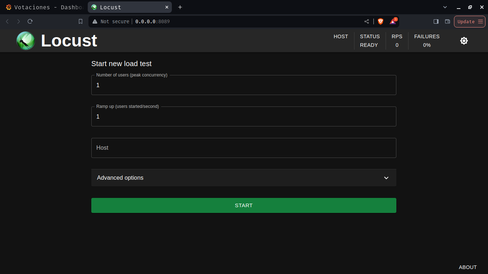
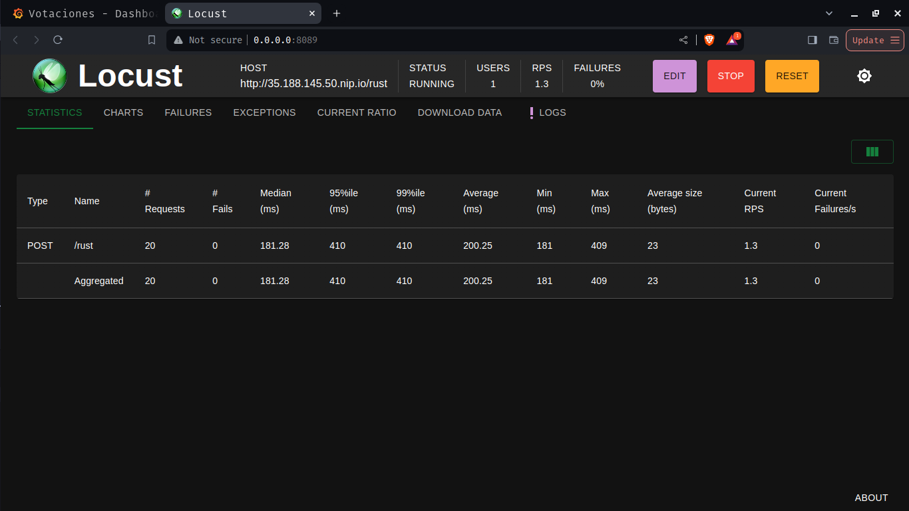
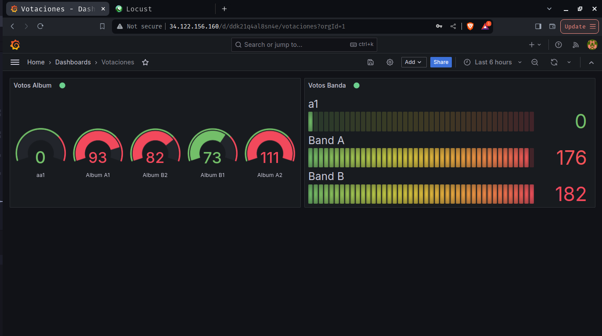
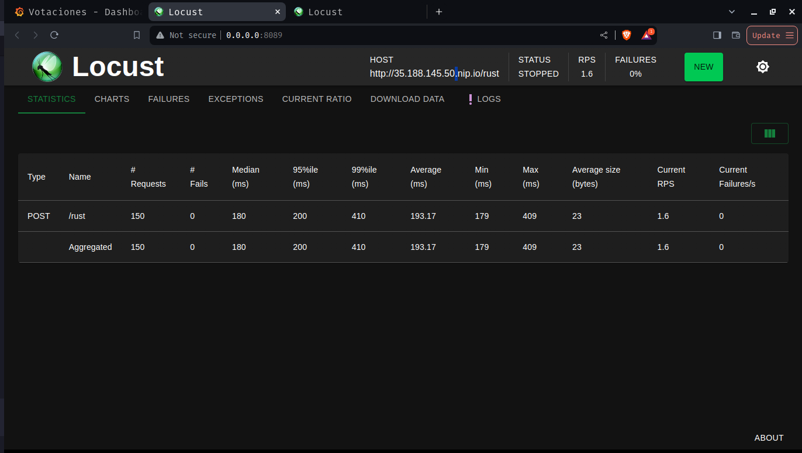
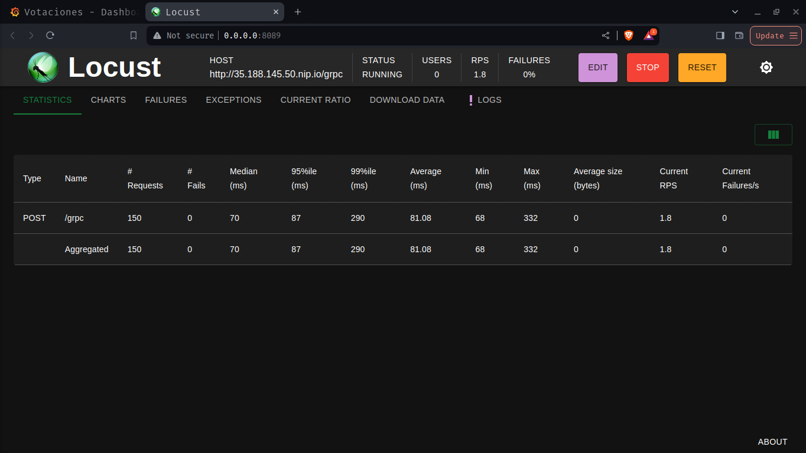

# Proyecto 2: Sistema de votaciones

- Nombre: Damián Ignacio Peña Afre
- Carnet: 202110568

## Introducción

Este proyecto tiene como objetivo principal la implementación de un sistema de gestión de votaciones para un concurso de bandas de música guatemalteca. La meta es dirigir tráfico de datos a través de archivos de votación hacia diversos servicios, tales como gRPC y WebAssembly (Wasm), los cuales se encargarán de encolar y procesar los datos entrantes. Además, se establecerán consumidores que estarán atentos al sistema de colas para almacenar los datos en una base de datos Redis, permitiendo así su visualización en tiempo real a través de paneles de control.

Adicionalmente, se empleará una base de datos MongoDB para almacenar los registros de actividad (logs) generados por el sistema. Estos registros estarán disponibles para su consulta mediante una aplicación web dedicada.

Con este proyecto, se busca crear una infraestructura robusta y eficiente que permita gestionar el proceso de votación de manera escalable, confiable y transparente, asegurando una experiencia óptima tanto para los participantes como para los administradores del concurso.


## Objetivos

1. Implementar un sistema distribuido basado en microservicios utilizando Kubernetes como plataforma de orquestación, con el fin de garantizar la escalabilidad, la disponibilidad y la flexibilidad del sistema.
2. Establecer sistemas de mensajería para encolar y gestionar eficientemente el tráfico de datos entre los distintos servicios del sistema, asegurando una comunicación fluida y confiable.
3. Utilizar Grafana como herramienta principal para crear interfaces gráficas de dashboards, permitiendo la visualización en tiempo real de métricas y estadísticas relevantes del sistema, lo cual facilitará la monitorización y el análisis de su desempeño.


## Tecnologías Utilizadas

- Locust: Locust es una herramienta de prueba de carga de código abierto que permite simular el comportamiento de usuarios en un sistema. Se utiliza para evaluar el rendimiento y la capacidad de respuesta del sistema bajo diferentes condiciones de carga.
- Kubernetes: Kubernetes es una plataforma de código abierto diseñada para automatizar la implementación, el escalado y la gestión de aplicaciones en contenedores. Proporciona herramientas para desplegar, gestionar y escalar aplicaciones de manera eficiente y confiable en entornos de producción.
- gRPC: gRPC es un framework de comunicación de código abierto desarrollado por Google que permite la comunicación eficiente entre servicios distribuidos. Utiliza el protocolo HTTP/2 para la transferencia de datos y protobuf como formato de serialización, lo que lo hace adecuado para aplicaciones modernas de microservicios.
- Rust con Wasm: Rust es un lenguaje de programación de sistemas que se caracteriza por su rendimiento, seguridad y concurrencia. Wasm (WebAssembly) es un formato binario que permite ejecutar código de alto rendimiento en navegadores web. Utilizar Rust con Wasm permite desarrollar aplicaciones web con rendimiento cercano al código nativo.
- Kafka: Apache Kafka es una plataforma de transmisión de datos distribuida que se utiliza para la gestión de eventos en tiempo real. Proporciona capacidades de publicación/suscripción y almacenamiento de eventos de manera escalable y tolerante a fallos.
- Go: Go es un lenguaje de programación de código abierto desarrollado por Google que se caracteriza por su simplicidad, rendimiento y concurrencia. Es ampliamente utilizado para el desarrollo de aplicaciones de servidor y servicios web.
- Redis: Redis es una base de datos en memoria de código abierto que se utiliza para el almacenamiento y la recuperación de datos de manera rápida y eficiente. Es conocida por su alta velocidad y su capacidad para manejar una gran cantidad de operaciones por segundo.
- MongoDB: MongoDB es una base de datos NoSQL de código abierto que se utiliza para el almacenamiento de datos de documentos JSON. Es altamente escalable y flexible, lo que la hace adecuada para una amplia gama de aplicaciones.
- Grafana: Grafana es una plataforma de análisis y visualización de datos de código abierto que se utiliza para crear dashboards y gráficos interactivos. Es compatible con una variedad de fuentes de datos y es ampliamente utilizada para monitorizar y analizar el rendimiento de sistemas complejos.
- Nuxt (Vue): Nuxt es un framework de código abierto basado en Vue.js que se utiliza para desarrollar aplicaciones web de una sola página (SPA). Proporciona funcionalidades adicionales como renderización del lado del servidor (SSR) y generación de sitios estáticos, lo que facilita la creación de aplicaciones web rápidas y eficientes.

## Deployments


### Consumer

 ```yaml
 apiVersion: apps/v1
kind: Deployment
metadata:
  labels:
    app: golang-consumer
  name: golang-consumer
  namespace: so1-proyecto2
spec:
  replicas: 1
  selector:
    matchLabels:
      app: golang-consumer
  strategy: {}
  template:
    metadata:
      labels:
        app: golang-consumer
    spec:
      containers:
        - name: golang-consumer
          image: damianpeaf/so1-proyecto2-consumer
          imagePullPolicy: Always
          resources:
            limits:
              cpu: "100m"
              memory: "128Mi"
          env:
            - name: KAFKA_BROKER
              valueFrom:
                secretKeyRef:
                  name: kafka-boostrap-secret
                  key: bootstrap.servers
            - name: MONGO_URL
              valueFrom:
                secretKeyRef:
                  name: mongo-secret
                  key: url
            - name: REDIS_URL
              valueFrom:
                secretKeyRef:
                  name: redis-secret
                  key: url
            - name: REDIS_PASSWORD
              valueFrom:
                secretKeyRef:
                  name: redis-password-secret
                  key: password
```

Este deployment se encarga de consumir los mensajes de la cola de Kafka y almacenarlos en una base de datos Redis y MongoDB. Para ello, se utilizan las variables de entorno `KAFKA_BROKER`, `MONGO_URL`, `REDIS_URL` y `REDIS_PASSWORD` para configurar las conexiones a los servicios correspondientes. La imagen utilizada es `damianpeaf/so1-proyecto2-consumer`, que contiene el código necesario para funcionar como consumidor de mensajes de Kafka.

### GrpcProducer

 ```yaml
apiVersion: apps/v1
kind: Deployment
metadata:
  labels:
    app: grpc-producer
  name: grpc-producer
  namespace: so1-proyecto2
spec:
  replicas: 1
  selector:
    matchLabels:
      app: grpc-producer
  strategy: {}
  template:
    metadata:
      labels:
        app: grpc-producer
    spec:
      containers:
        - name: grpc-client
          image: damianpeaf/so1-proyecto2-grpc-client
          imagePullPolicy: Always
          ports:
            - containerPort: 3000
          resources:
            limits:
              cpu: "0.2"
              memory: "128Mi"
        - name: grpc-server
          image: damianpeaf/so1-proyecto2-grpc-server
          imagePullPolicy: Always
          ports:
            - containerPort: 3001
          resources:
            limits:
              cpu: "100m"
              memory: "128Mi"
          env:
            - name: KAFKA_BROKER
              valueFrom:
                secretKeyRef:
                  name: kafka-boostrap-secret
                  key: bootstrap.servers
status: {}
```

Este deployment se encarga de recibir las votaciones a través de gRPC y publicarlas en la cola de Kafka. Para ello, se utilizan las variables de entorno `KAFKA_BROKER` para configurar la conexión al servicio de Kafka. La imagen utilizada es `damianpeaf/so1-proyecto2-grpc-client` para el cliente gRPC y `damianpeaf/so1-proyecto2-grpc-server` para el servidor gRPC.

### RustProducer

 ```yaml
 apiVersion: apps/v1
kind: Deployment
metadata:
  labels:
    app: rust-producer
  name: rust-producer
  namespace: so1-proyecto2
spec:
  replicas: 1
  selector:
    matchLabels:
      app: rust-producer
  strategy: {}
  template:
    metadata:
      labels:
        app: rust-producer
    spec:
      containers:
        - name: rust-client
          image: damianpeaf/so1-proyecto2-rust-client
          imagePullPolicy: Always
          ports:
            - containerPort: 3000
          resources:
            limits:
              cpu: "0.2"
              memory: "128Mi"
        - name: rust-server
          image: damianpeaf/so1-proyecto2-rust-server
          imagePullPolicy: Always
          ports:
            - containerPort: 3001
          resources:
            limits:
              cpu: "100m"
              memory: "128Mi"
          env:
            - name: KAFKA_BROKER
              valueFrom:
                secretKeyRef:
                  name: kafka-boostrap-secret
                  key: bootstrap.servers
status: {}
```

Este deployment se encarga de recibir las votaciones a través de Rust y publicarlas en la cola de Kafka. Para ello, se utilizan las variables de entorno `KAFKA_BROKER` para configurar la conexión al servicio de Kafka. La imagen utilizada es `damianpeaf/so1-proyecto2-rust-client` para el cliente Rust y `damianpeaf/so1-proyecto2-rust-server` para el servidor Rust.


### Redis

 ```yaml
 apiVersion: apps/v1
kind: Deployment
metadata:
  labels:
    run: redis
  name: redis
  namespace: so1-proyecto2
spec:
  replicas: 1
  selector:
    matchLabels:
      run: redis
  template:
    metadata:
      labels:
        run: redis
    spec:
      containers:
        - name: redis
          image: redis:6.2
          command:
            - redis-server
            - /redisconf/redis.conf
          ports:
            - containerPort: 6379
          resources:
            limits:
              cpu: "200m"
              memory: "128Mi"
          volumeMounts:
            - mountPath: /redisconf
              name: config
      volumes:
        - name: config
          configMap:
            name: redis-configmap
            items:
              - key: redis-config
                path: redis.conf
```

Este deployment se encarga de desplegar un contenedor con el servicio de Redis, que se utiliza para almacenar los datos de votación en memoria. Se utiliza una configuración personalizada a través de un ConfigMap para establecer la configuración del servicio de Redis. La imagen utilizada es `redis:6.2`.

### MongoDB

 ```yaml
 apiVersion: apps/v1
kind: Deployment
metadata:
  name: mongo-db
  namespace: so1-proyecto2
  labels:
    app: mongo-db
spec:
  replicas: 1
  selector:
    matchLabels:
      app: mongo-db
  template:
    metadata:
      labels:
        app: mongo-db
    spec:
      containers:
        - name: mongo
          image: mongo
          ports:
            - containerPort: 27017
          env:
            - name: MONGO_INITDB_ROOT_USERNAME
              value: root
            - name: MONGO_INITDB_ROOT_PASSWORD
              value: m0nG0p4ssw0rD
          resources:
            limits:
              cpu: "300m"
              memory: "256Mi"
---
apiVersion: v1
kind: Service
metadata:
  name: mongo-svc-lb
  namespace: so1-proyecto2
spec:
  type: LoadBalancer
  ports:
    - port: 27017
      targetPort: 27017
  selector:
    app: mongo-db
---
apiVersion: v1
kind: Service
metadata:
  name: mongo-svc-clusterip
  namespace: so1-proyecto2
spec:
  type: ClusterIP
  ports:
    - port: 27017
      targetPort: 27017
  selector:
    app: mongo-db

```

Este deployment se encarga de desplegar un contenedor con el servicio de MongoDB, que se utiliza para almacenar los registros de actividad (logs) generados por el sistema. Se establecen credenciales de acceso a través de variables de entorno y se exponen los puertos 27017 para la comunicación con la base de datos. La imagen utilizada es `mongo`.

### Grafana

 ```yaml
 apiVersion: apps/v1
kind: Deployment
metadata:
  name: grafana
  namespace: so1-proyecto2
spec:
  replicas: 1
  selector:
    matchLabels:
      app: grafana
  template:
    metadata:
      name: grafana
      labels:
        app: grafana
    spec:
      containers:
        - name: grafana
          image: damianpeaf/so1-proyecto2-grafana
          imagePullPolicy: Always
          ports:
            - name: grafana
              containerPort: 3000
          resources:
            limits:
              cpu: "100m"
              memory: "128Mi"
          volumeMounts:
            - mountPath: /var/lib/grafana
              name: grafana-storage
      volumes:
        - name: grafana-storage
          emptyDir: {}
```

Este deployment se encarga de desplegar un contenedor con el servicio de Grafana, que se utiliza para crear dashboards y visualizar métricas y estadísticas del sistema. Se utiliza un volumen local para almacenar los datos de Grafana. La imagen utilizada es `damianpeaf/so1-proyecto2-grafana`.


## Servicios

### Grpc

 ```yaml
 apiVersion: v1
kind: Service
metadata:
  labels:
    app: grpc-producer
  name: grpc-producer-svc
  namespace: so1-proyecto2
spec:
  ports:
    - port: 3000
      protocol: TCP
      targetPort: 3000
  selector:
    app: grpc-producer
status:
  loadBalancer: {}
```

Este servicio expone el puerto 3000 del deployment `grpc-producer` para permitir la comunicación con el cliente gRPC. Se utiliza el protocolo TCP para la comunicación y se establece un balanceador de carga para distribuir el tráfico entre los pods del deployment.

### Rust

 ```yaml
 apiVersion: v1
kind: Service
metadata:
  labels:
    app: rust-producer
  name: rust-producer-svc
  namespace: so1-proyecto2
spec:
  ports:
    - port: 3000
      protocol: TCP
      targetPort: 3000
  selector:
    app: rust-producer
status:
  loadBalancer: {}
```

Este servicio expone el puerto 3000 del deployment `rust-producer` para permitir la comunicación con el cliente Rust. Se utiliza el protocolo TCP para la comunicación y se establece un balanceador de carga para distribuir el tráfico entre los pods del deployment.

### Redis

 ```yaml
 apiVersion: v1
kind: Service
metadata:
  labels:
    app: redis
  name: redis-svc
  namespace: so1-proyecto2
spec:
  ports:
    - port: 6379
      protocol: TCP
      targetPort: 6379
  selector:
    app: redis
  type: ClusterIP
---
apiVersion: v1
kind: Service
metadata:
  name: redis-svc-lb
  namespace: so1-proyecto2
spec:
  type: LoadBalancer
  ports:
    - port: 6379
      targetPort: 6379
  selector:
    app: redis
```

Estos dos servicios exponen el puerto 6379 del deployment `redis` para permitir la comunicación con el servicio de Redis. Se utiliza el protocolo TCP para la comunicación y se establece un balanceador de carga para distribuir el tráfico entre los pods del deployment.

### MongoDB

```yaml
apiVersion: v1
kind: Service
metadata:
  name: mongo-svc-lb
  namespace: so1-proyecto2
spec:
  type: LoadBalancer
  ports:
    - port: 27017
      targetPort: 27017
  selector:
    app: mongo-db
---
apiVersion: v1
kind: Service
metadata:
  name: mongo-svc-clusterip
  namespace: so1-proyecto2
spec:
  type: ClusterIP
  ports:
    - port: 27017
      targetPort: 27017
  selector:
    app: mongo-db
```

Estos dos servicios exponen el puerto 27017 del deployment `mongo-db` para permitir la comunicación con el servicio de MongoDB. Se utiliza el protocolo TCP para la comunicación y se establece un balanceador de carga para distribuir el tráfico entre los pods del deployment.


### Grafana

```yaml
apiVersion: v1
kind: Service
metadata:
  name: grafana-svc
  namespace: so1-proyecto2
spec:
  selector:
    app: grafana
  ports:
    - protocol: TCP
      port: 80
      targetPort: 3000
  type: LoadBalancer
```

Este servicio expone el puerto 80 del deployment `grafana` para permitir la comunicación con el servicio de Grafana. Se utiliza el protocolo TCP para la comunicación y se establece un balanceador de carga para distribuir el tráfico entre los pods del deployment.

### Ejemplo del funcionamiento

1. Seleccionar en locust el tipo de enpoint a utilizar gRPC o Rust.



2. Locust realiza laspeticiones



3. El consumidor manda los datos a Redis y MongoDB y pueden ser visualizados en Grafana




### Conclusiones


#### ¿Qué servicio se tardó menos? ¿Por qué?

Resultados de las pruebas de rendimiento:

- Rust



- gRPC



El servicio que se tardó menos fue el implementado en Go que utiliza gRPC para la comunicación entre cliente y servidor. Esto se debe a que gRPC utiliza HTTP/2 como su protocolo de transporte subyacente, mientras que el servicio en Rust utiliza HTTP para la comunicación. HTTP/2 ofrece varias mejoras sobre HTTP/1.x, como la multiplexación de múltiples solicitudes en una única conexión TCP, compresión de cabeceras y streams, lo que puede resultar en un rendimiento mejorado y menor latencia, especialmente en aplicaciones con muchas solicitudes concurrentes o transferencia de datos pesados.

#### ¿En qué casos utilizarías grpc y en qué casos utilizarías wasm?

1. **gRPC**:
   - **Alta velocidad y eficiencia**: gRPC es ideal cuando la velocidad y la eficiencia son críticas, especialmente en sistemas distribuidos donde se necesitan comunicaciones de alto rendimiento entre servicios.
   - **Aplicaciones distribuidas**: es una excelente opción para sistemas distribuidos y microservicios donde se necesita una comunicación eficiente entre diferentes componentes.
   - **Tipado fuerte**: gRPC utiliza gRPC utiliza Protobuf o FlatBuffers para la serialización de datos, lo que proporciona un sistema de tipado fuerte y una interoperabilidad mejorada entre diferentes lenguajes de programación.

2. **WebAssembly (Wasm)**:
   - **Portabilidad**: Wasm es útil cuando necesitas portabilidad y quieres ejecutar código en múltiples plataformas y entornos de ejecución sin preocuparte por el lenguaje de programación subyacente.
   - **Aplicaciones web modernas**: es especialmente útil en el desarrollo de aplicaciones web modernas donde se pueden ejecutar partes del código en el navegador del cliente para mejorar el rendimiento y la experiencia del usuario.
   - **Extensibilidad**: Wasm es una excelente opción para extender aplicaciones existentes con módulos escritos en otros lenguajes de programación y ejecutarlos de manera segura en un entorno de navegador.

En resumen, gRPC es preferible en casos donde se necesita una comunicación rápida y eficiente entre servicios distribuidos, mientras que Wasm es útil para aplicaciones web modernas que requieren portabilidad y extensibilidad.