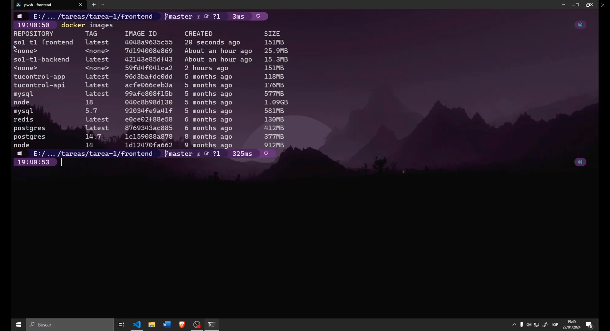

# Tarea 1

- Nombre: Damián Ignacio Peña Afre
- Carnet: 202110568

## Link del video explicativo

<!-- https://youtu.be/VeUE8LqnQYs-->
[https://youtu.be/VeUE8LqnQYs](https://youtu.be/VeUE8LqnQYs)

## Capturas de pantalla

### Construcción de la imagen backend

### Ejecución de la imagen backend

### Construcción de la imagen frontend

### Imagenes generadas

### Ejecución de la imagen frontend

### Aplicación corriendo

