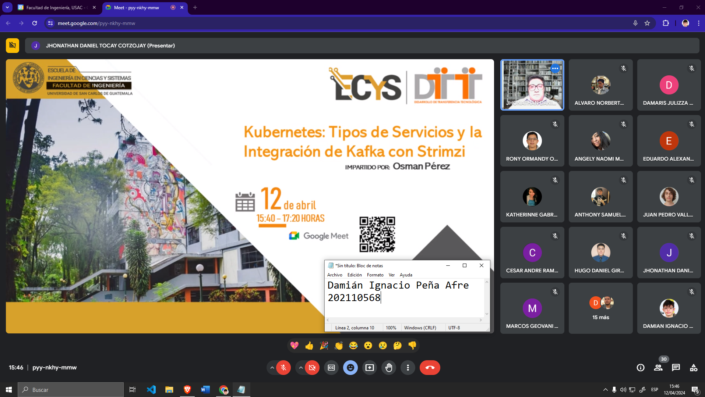

# Tarea 5

- Nombre: Damián Ignacio Peña Afre
- Carnet: 202110568

# Ensayo

## Kubernetes: Tipos de Servicios y la Integración de Kafka con Strimzi

En el ecosistema de Kubernetes, la flexibilidad es clave. Los diferentes tipos de servicios ofrecen soluciones para una variedad de necesidades de conectividad, desde la exposición interna de aplicaciones hasta la conexión externa con equilibradores de carga. Esta diversidad proporciona una base sólida para integrar servicios como Kafka, que a menudo requieren una exposición externa para interactuar con otras aplicaciones o sistemas.

La integración de Kafka con Strimz es un paso significativo en la simplificación del despliegue y la gestión de clústeres Kafka en entornos Kubernetes. Strimz aprovecha la infraestructura de Kubernetes para automatizar tareas como la creación de pods, servicios y otros recursos necesarios para ejecutar Kafka de manera eficiente. Esto significa que los equipos de desarrollo pueden centrarse en la lógica de la aplicación y la innovación, en lugar de preocuparse por la configuración y el mantenimiento de la infraestructura subyacente.

Además, la disponibilidad de una interfaz web y una CLI para administrar los clústeres de Kafka simplifica aún más las operaciones diarias. Los equipos pueden monitorear el rendimiento, escalar según sea necesario y realizar tareas de mantenimiento con facilidad, todo desde una interfaz intuitiva. Esta capacidad de administración simplificada es especialmente valiosa en entornos de producción donde la estabilidad y el rendimiento son críticos.

La integración de Kafka con Strimz abre nuevas oportunidades para una variedad de casos de uso. Desde el procesamiento en tiempo real hasta la integración de sistemas heterogéneos, Kafka se convierte en una solución versátil que puede adaptarse a las necesidades cambiantes de las aplicaciones modernas. Además, Strimz allana el camino hacia un futuro donde la integración continua y el desarrollo ágil son la norma, proporcionando una base sólida para la evolución continua de las aplicaciones y la infraestructura tecnológica.

# Capturas de la conferencia

- Inicio
  

- Final
  
